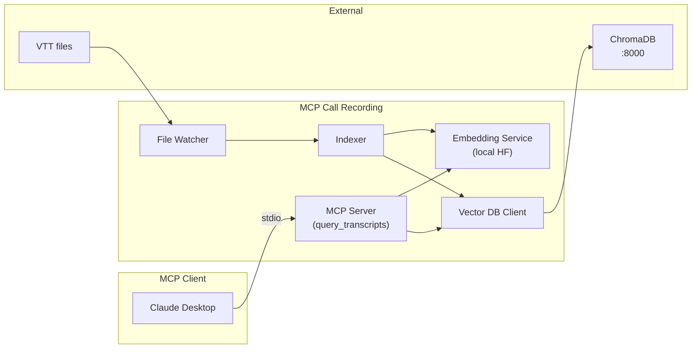

# Architecture

High-level architecture of the MCP Call Recording server.

## Components

- **MCP Client**: Claude Desktop (or Copilot Studio with HTTP transport) sends natural language queries via stdio.
- **MCP Server**: Exposes the `query_transcripts` tool and routes requests to the embedding and vector services.
- **Embedding Service**: Generates embeddings locally using Hugging Face models (`@xenova/transformers`); no API key required.
- **Vector DB Client**: Connects to the ChromaDB server at `http://localhost:8000` for semantic search.
- **File Watcher**: Monitors `VTT_DIRECTORY` for new, changed, or deleted `.vtt` files.
- **Indexer**: Parses VTT files, extracts metadata, chunks text, generates embeddings, and writes to Chroma.

See [README.md](../README.md) and [CHROMADB_SETUP.md](../CHROMADB_SETUP.md) for setup and details.
