# Transcript-Level Structured Summary Indexing

## Overview

Add a transcript-level summary index to handle single-transcript queries like "Summarize Brian Hopkins call with Acme". This replaces the current chunk-level approach with a single summary per transcript.

- **Transcript summaries**: One structured summary per transcript for all queries
- **Scope**: Single-transcript queries only (multi-transcript queries are out of scope for now)

## Architecture Changes

### New Components

1. **Summary Service** (`src/services/summaryService.ts`):

   - Generates structured summaries from full transcripts using OpenAI API
   - Uses a specific prompt template that produces formatted text output (not JSON)
   - Output format includes:
     - CALL TYPE
     - PARTICIPANTS (with roles/companies)
     - COMPANY/COMPANIES
     - DATE
     - DURATION
     - SUMMARY (2-3 paragraphs organized by topic)
     - KEY TOPICS (bulleted list with context)
     - ACTION ITEMS (bulleted list)
     - DECISIONS MADE (bulleted list)
   - Returns the complete formatted summary text as a single string

2. **Transcript Summary Collection**:

   - New ChromaDB collection: `transcript_summaries`
   - One document per transcript with:
     - **Embedding**: Generated from the **ENTIRE structured summary text** (all sections: CALL TYPE, PARTICIPANTS, SUMMARY, KEY TOPICS, ACTION ITEMS, DECISIONS MADE, etc.)
     - **Document**: The complete formatted summary text string
     - **Metadata**: File metadata (filePath, fileName, callDate from filename) + optionally parsed structured fields for filtering
     - **Note**: The entire structured summary (all sections combined) is embedded as one document

3. **Query Tool** (`src/tools/query.ts`):

   - Updated to query ONLY the transcript summary collection
   - No query routing needed (single-transcript queries only)
   - Searches transcript summaries by semantic similarity
   - Returns the most relevant transcript summary

### Data Flow

```mermaid
flowchart TD
    subgraph Indexing["Indexing Flow"]
        VTT[VTT File] --> Parser[VTT Parser]
        Parser --> FullText[Full Transcript Text]
        FullText --> SummaryService[Summary Service<br/>OpenAI API]
        SummaryService --> FormattedSummary[Formatted Summary Text<br/>CALL TYPE, PARTICIPANTS, SUMMARY,<br/>KEY TOPICS, ACTION ITEMS, etc.]
        FormattedSummary --> SummaryEmbed[Embed Entire Summary Text<br/>Local Model]
        SummaryEmbed --> SummaryCollection[Summary Collection<br/>ChromaDB]
    end
    
    subgraph Query["Query Flow"]
        QueryText[User Query] --> EmbedQuery[Generate Query Embedding]
        EmbedQuery --> SummarySearch[Search Summary Collection<br/>Semantic match on full summary]
        SummarySearch --> SummaryResult[Return Formatted Summary]
    end
```



## Implementation Plan

### 1. Create Summary Service (`src/services/summaryService.ts`)

- **`generateSummary(transcript: ParsedTranscript): Promise<TranscriptSummary>`**
  - Takes full parsed transcript (concatenate all segments into full text)
  - Uses OpenAI API with a specific prompt template to generate formatted summary
  - Prompt format (exact match to user's specification):
    ```
    Analyze this call transcript and create a structured summary.
    
    Format your response EXACTLY as follows:
    
    CALL TYPE: [guidance session/demo/onboarding/sales call/technical review/etc]
    PARTICIPANTS: [Name (Role/Company), Name (Role/Company), ...]
    COMPANY/COMPANIES: [Companies where the call participants work - NOT just companies mentioned]
    DATE: [Extract if mentioned in transcript, otherwise leave blank]
    DURATION: [Extract if mentioned, otherwise leave blank]
    
    SUMMARY:
    [2-3 well-organized paragraphs covering the main discussion points. Organize by topic/theme, not chronologically. Include specific technical details, decisions made, and context.]
    
    KEY TOPICS:
    - [Topic 1 with brief context]
    - [Topic 2 with brief context]
    - [Topic 3 with brief context]
    
    ACTION ITEMS:
    - [Action item 1]
    - [Action item 2]
    
    DECISIONS MADE:
    - [Decision 1]
    - [Decision 2]
    
    Guidelines:
    - Use full names consistently (e.g., "Brian Hopkins" not "Brian" or "Hopkins")
    - Include company affiliations in parentheses for clarity
    - COMPANY/COMPANIES should list only the companies where call participants work, NOT companies just mentioned in discussion
    - Be specific about technical topics (don't just say "API discussion", say "OAuth 2.0 authentication implementation")
    - Preserve important details like timelines, numbers, specific product names
    
    Transcript:
    {transcript_text}
    ```

  - Returns the complete formatted summary text as a single string
  - Requires `OPENAI_API_KEY` environment variable

### 2. Update Types (`src/types/transcript.ts`)

Add:

```typescript
export interface TranscriptSummary {
  id: string;
  summaryText: string;  // Complete formatted summary (all sections: CALL TYPE, PARTICIPANTS, SUMMARY, KEY TOPICS, ACTION ITEMS, DECISIONS MADE)
  embedding: number[];   // Embedding of the ENTIRE summaryText (generated via EmbeddingService)
  metadata: TranscriptMetadata; // File metadata (filePath, fileName, callDate from filename, etc.)
}
```

**Embedding Strategy:**

- The **ENTIRE structured summary text** (all sections combined: CALL TYPE, PARTICIPANTS, COMPANY/COMPANIES, DATE, DURATION, SUMMARY, KEY TOPICS, ACTION ITEMS, DECISIONS MADE) is embedded as one document
- This complete formatted text is stored as the document in ChromaDB
- The embedding captures semantic meaning across all sections (topics, decisions, action items, participants, etc.)
- File metadata (filePath, fileName, callDate) is stored separately in ChromaDB metadata for filtering

### 3. Update Vector Database (`src/services/vectorDb.ts`)

- Add methods:
  - `addTranscriptSummary(summary: TranscriptSummary): Promise<void>`
  - `searchSummaries(queryEmbedding: number[], limit: number, minScore: number): Promise<TranscriptSummary[]>`
  - `isSummaryIndexed(filePath: string): Promise<boolean>`
  - `deleteSummary(filePath: string): Promise<void>`
- Initialize second collection: `transcript_summaries`

### 4. Update Indexer (`src/services/indexer.ts`)

- Remove or skip chunk generation logic
- After parsing VTT, generate transcript summary directly
- Store summary in `transcript_summaries` collection
- One summary per transcript file

### 5. Update Query Tool (`src/tools/query.ts`)

- Simplify to query ONLY transcript summaries (no routing logic needed)
- Generate query embedding
- Search transcript summaries collection
- Return top matching summary (or top N if user wants multiple results)
- Format and display the complete formatted summary text

### 6. Environment Variables

Add to `.env`:

- `OPENAI_API_KEY` (required, for generating structured summaries)
  - Note: This is separate from embeddings (which use local open-source models)
  - Used only for summary generation, not for embeddings

## Files to Modify

1. **`src/services/summaryService.ts`** (new) - OpenAI API integration for structured summary generation
2. **`src/types/transcript.ts`** (add `TranscriptSummary` interface)
3. **`src/services/vectorDb.ts`** (add summary collection methods)
4. **`src/services/indexer.ts`** (replace chunk indexing with summary generation)
5. **`src/tools/query.ts`** (update to query summaries only)
6. **`package.json`** (add `openai` package if not already present)
7. **`.env.example`** (add `OPENAI_API_KEY` for summary generation)

## Query Examples

**Supported queries** (single-transcript):

- "Summarize Brian Hopkins call with Acme"
- "What happened in the last CSM check-in call with Capital One?"
- "What were the action items from the Bank of America sales call"
- "What decisions were made in the Capital One call?"
- "Who participated in the Acme call?"

**Out of scope** (multi-transcript queries):

- "What are the risks raised by prospective clients in Sales calls in last month?"
- "Show me all action items across all calls"
- "What decisions were made in Q1 calls?"

These multi-transcript queries will be addressed in a future enhancement.

## Benefits

1. **Clarity**: One comprehensive summary per transcript with all key information
2. **Structure**: Formatted summary includes CALL TYPE, PARTICIPANTS, KEY TOPICS, ACTION ITEMS, DECISIONS MADE
3. **Performance**: Faster semantic search over summaries than over many chunks
4. **Simplicity**: Single tool, single collection, straightforward implementation

## Future Enhancements

- Multi-transcript aggregation (combine summaries for cross-call insights)
- Summary caching and incremental updates
- Custom summary templates per call type
